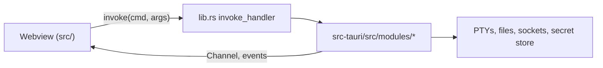

# Architecture

Code map. Contributor rules and gotchas: [TERVIA.md](TERVIA.md). Accepted
limits: [KNOWN-LIMITS.md](KNOWN-LIMITS.md).

## Shape

- Two processes. `src/`: React 19 webview, owns the UI. `src-tauri/`: Rust, owns every OS resource (PTYs, files, sockets, git, secret store).
- Webview to Rust: `invoke(cmd, args)`. Rust to webview: a Tauri `Channel` for streams, `tervia:` events for the rest.
- Every command is registered in `invoke_handler` in `src-tauri/src/lib.rs`. `scripts/command-registry-verify.ts` keeps that list matched to the `invoke` call sites.
- Three webviews: main (`index.html`), Settings (`settings.html`, `src/settings/`), float windows (`float.html`, `src/float/`). They share state through the store files and events, not React.

## Invariants

- The webview never touches the OS. Only commands do.
- Modules import each other through `@/*`, never a relative path (`scripts/check-imports.mjs`).
- Tabs never unmount. Inactive ones are hidden (`panes/PaneStack.tsx`), so sessions keep streaming.
- Secrets live only in the secret store (`secrets_*` commands). Store files hold metadata and `has*` flags.
- A remote path is never resolved against the local disk (`isRemoteEditorLeaf`, `editorPaneSession` in `terminal/lib/panes.ts`).
- Frontend paths are forward-slash. Split them with `src/lib/path.ts`.
- No blocking work in a sync command: Windows runs those on the UI thread. Pinned by `ui_thread_guard` in `lib.rs`.
- `app/App.tsx` wires modules together. Feature logic lives in `src/modules/<area>/`.

## Backend (`src-tauri/src/modules/`)

| Module                                             | Role                                                                                                                                                                                 |
| -------------------------------------------------- | ------------------------------------------------------------------------------------------------------------------------------------------------------------------------------------ |
| `ssh/`                                             | `russh` sessions, shells, jump chains, host-key pinning, `-L`/`-R`/`-D` forwards, SFTP (`sftp.rs`), remote git, key inspect and generate. One 2-worker tokio runtime.                |
| `rdp/`                                             | IronRDP sessions: TLS and CredSSP, certificate pinning (`tls.rs`), frames pulled with `rdp_take_frame` (`frame.rs`), clipboard (`cliprdr.rs`). Own 2-worker runtime, 8 sessions max. |
| `sync/`                                            | Sync: wire format and merge (`model.rs`), crypto (`crypto.rs`), pull and push (`engine.rs`), S3 and WebDAV (`providers/`).                                                           |
| `pty/`                                             | Local PTYs (`portable-pty`), shell integration scripts (`scripts/`), Windows Job Objects.                                                                                            |
| `pty_daemon/`                                      | Sidecar (same binary, `--pty-daemon`) that keeps PTYs alive across GUI restarts.                                                                                                     |
| `fs/`                                              | Explorer and editor IO, go to file, grep and replace, atomic writes (`atomic.rs`).                                                                                                   |
| `git/`                                             | Runs `git`, parses status. `git_run` and `ssh_git` share the `check_args` allowlist.                                                                                                 |
| `secrets.rs`                                       | Secret store: macOS Keychain, Windows DPAPI file (`secrets.bin`), Linux mode-0600 JSON file (`secrets.json`).                                                                        |
| `backup.rs`, `aesgcm.rs`                           | Backup sealing (PBKDF2-HMAC-SHA256, AES-256-GCM). The AES-GCM pair is shared with sync.                                                                                              |
| `clipboard.rs`                                     | Host-side clipboard (`arboard`) for paste and the RDP bridge.                                                                                                                        |
| `cli.rs`, `cli_paint.rs`                           | argv, `--help`/`--version`/`--update`, single-instance forwarding, the `~/.local/bin/tervia` shim.                                                                                   |
| `net.rs`                                           | HTTP probe and port check for URL detection.                                                                                                                                         |
| `format.rs`                                        | External formatter runner.                                                                                                                                                           |
| `shell/`                                           | One-shot and background commands. Registered, no frontend caller.                                                                                                                    |
| `appimage.rs`, `ids.rs`, `events.rs`, `lockext.rs` | AppImage env cleanup, bundle id and data paths, event names, poison-safe locks.                                                                                                      |

`src-tauri/tervia-cli/` builds the Windows console launcher `tervia.exe`. The
GUI binary is `TerviaApp`.

## Frontend (`src/modules/`)

| Module                                 | Role                                                                                   |
| -------------------------------------- | -------------------------------------------------------------------------------------- |
| `hosts/`                               | Host store (SSH and RDP), groups, tags, jump chains, Hosts and Known Hosts pages.      |
| `vault/`                               | Identities and keys, credential resolution (`resolve.ts`), Vault page.                 |
| `ssh/`                                 | One shared session per host (`tunnel.ts`), host-key prompt, SFTP explorer.             |
| `forwards/`                            | Forward rules store, runtime, autostart and retry, Port Forwarding page.               |
| `rdp/`                                 | RDP pane, frame blit, input, SSH tunnel dial (`dial.ts`).                              |
| `backup/`                              | Backup file format, import apply, `ssh_config` and PuTTY import.                       |
| `sync/`                                | Sync scheduler, envelopes, sync state.                                                 |
| `terminal/`                            | xterm sessions, local and SSH drivers, OSC 7/133, URL forwarding, agent CLI detection. |
| `editor/`                              | CodeMirror, languages, formatters, Markdown preview.                                   |
| `explorer/`                            | File tree, go to file, grep, git decorations.                                          |
| `panes/`, `tabs/`, `workspaces/`       | Split tree, tab model (`useTabs`), workspace persistence, board, float windows.        |
| `header/`, `statusbar/`, `rightPanel/` | Top bar and quick connect, bottom bar, sidebar placement.                              |
| `shortcuts/`, `commandPalette/`        | Keymap, command registry, palette (`@` files, `#` hosts).                              |
| `settings/`, `theme/`                  | Settings state (the UI is `src/settings/`), themes.                                    |
| `scm/`                                 | Git calls for decorations and branch name. No panel.                                   |
| `updater/`                             | In-app updater.                                                                        |

## Data

App-data dir of the bundle id (`dev.rendy.tervia`; `pnpm tauri:dev` uses
`dev.rendy.tervia.dev`):

| File                     | Holds                        |
| ------------------------ | ---------------------------- |
| `tervia-hosts.json`      | Hosts, groups                |
| `tervia-vault.json`      | Identities, keys (no bodies) |
| `tervia-forwards.json`   | Forward rules                |
| `tervia-sync.json`       | Sync config and state        |
| `tervia-settings.json`   | Preferences                  |
| `tervia-workspaces.json` | Tabs, panes, cwd             |
| `tervia-cli-agents.json` | Agent CLI list               |

- All but `tervia-sync.json` go through `createRecoveredStore` (`src/lib/recoveredStore.ts`): whole-file atomic write plus a `.bak` snapshot.
- Secret services: `tervia-hosts`, `tervia-vault`, `tervia-sync`. Accounts are `<id>::<field>`.
- Synced records carry `updatedAt`. Deletes leave 90-day tombstones (`src/lib/tombstones.ts`). Device-local fields never sync: pins, last connected, `startWithApp`.

## Flows

- **Local terminal**: xterm, `pty_write`, daemon PTY, output over a Channel, xterm.
- **SSH terminal**: `ssh/tunnel.ts` reuses or opens the host's session (`ssh_open`: jump chain, host-key prompt), then one `ssh_shell_open` channel per tab. The last reference closes the session.
- **Forward**: rule, session for its host, then `ssh_forward_open` (`-L`), `ssh_remote_forward_open` (`-R`) or `ssh_socks_open` (`-D`).
- **RDP**: optional SSH tunnel (`rdp/dial.ts`), `rdp_open`, `frameReady` event, `rdp_take_frame`, canvas.
- **Backup**: export calls `backup_seal_payload` (Rust reads the secrets and seals). Import calls `backup_open_payload`, validates, writes the stores, then `backup_apply_secrets`.
- **Sync**: an edit marks its record dirty and pushes after 5 s. Window focus pulls (60 s floor), merges in Rust, and lands each record through its store's `applyRemote`.
