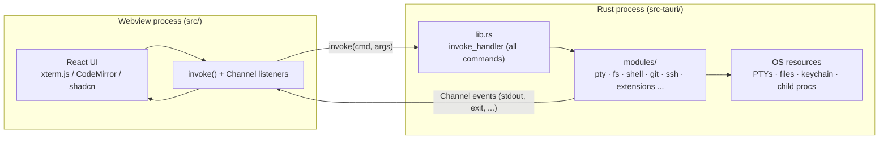

# Architecture

The authoritative technical reference for TEDI: how the system is structured
and why it is built that way. Read this to understand the design; use
[TEDI.md](TEDI.md) as the dense per-module map and navigation index, and
[CONTRIBUTING.md](CONTRIBUTING.md) for build, test, and PR conventions.

TEDI (Terminal Director) is a lightweight,
cross-platform terminal with split panes, tab groups, workspaces, a CodeMirror
editor, and a bring-your-own-key AI agent. It is a [Tauri 2](https://tauri.app)
desktop app for macOS, Linux, and Windows.

## 1. The big picture: a two-process app

TEDI has two halves that never share memory:

- **Frontend** (`src/`): a React 19 + TypeScript app rendered in a webview
  (xterm.js terminals with the WebGL renderer, CodeMirror 6 editor, shadcn/ui).
  It owns all UI and client state and never touches the OS directly.
- **Backend** (`src-tauri/`): a Rust process that owns every OS resource: PTYs,
  the filesystem, git, SSH, the OS keychain, and child processes.

The webview reaches the OS only by calling `invoke("command_name", args)`, which
runs a `#[tauri::command]` function in Rust. Long-lived output (terminal bytes,
SSH events, install progress) streams back over a Tauri `Channel`. Every command
is registered in one place, the `invoke_handler` block in
[`src-tauri/src/lib.rs`](src-tauri/src/lib.rs), so that one file is the complete
index of the backend API surface (103 commands today).



There are two webviews: the main window and a separate **Settings window**
(entry [`src/settings/main.tsx`](src/settings/main.tsx), opened by the
`open_settings_window` command). They share persisted state through
`tauri-plugin-store`, not through React, so any store the main window reads must
be hydrated in both. This is why two similarly named folders exist:

| Folder                  | Role                                                                |
| ----------------------- | ------------------------------------------------------------------- |
| `src/settings/`         | The Settings UI (a separate webview).                               |
| `src/modules/settings/` | The settings state layer (store + preferences), read by both windows. |

## 2. Design principles

These invariants shape the whole codebase. Violating one is almost always a bug.

- **The webview never touches the OS.** All OS access is a `#[tauri::command]`.
  The single `invoke_handler` in `lib.rs` is the audit surface and the API index.
- **Modules are self-contained.** Each `src/modules/<area>/` feature imports only
  through the `@/*` alias, never a relative path across modules. A guard,
  `scripts/check-imports.mjs`, enforces this. Most expose a thin `index.ts` barrel.
- **Tabs never unmount.** Switching tabs hides the inactive one with
  `invisible pointer-events-none`, so PTYs and dev servers keep streaming in the
  background. State lives in `tabs/lib/useTabs`, the source of truth.
- **Secrets live only in the OS keychain.** API keys and SSH passwords go through
  the Rust `secrets_*` commands (keychain service `tedi`). They never touch disk,
  the settings store, or `localStorage`.
- **Canonical path form on the frontend is forward-slash.** OSC 7 already arrives
  forward-slash; `homeDir()` returns backslashes on Windows and is converted at
  the boundary. Anywhere a path may come from the OS or the explorer, split with
  `.split(/[\\/]/)`, not `.split("/")`.
- **Extensions run with full privilege; the trust boundary is install-time review.**
  The permission gate on the host API is an advisory convenience, not a sandbox
  (see Section 7).
- **App.tsx coordinates, it does not implement.** The top-level component owns
  cross-module wiring (extension bridges, right-panel mutual exclusion, workspace
  orchestration, the global shortcut map, the AI live-context bridge). Feature
  logic lives in `src/modules/<area>/`.

## 3. Backend (Rust, `src-tauri/src/`)

`lib.rs` registers every command and drives app boot plus CLI dispatch. `main.rs`
is a thin shim. Logic is split into `modules/` (folders for multi-file
subsystems, flat files for single-purpose ones).

| Module          | Responsibility                                                                                   |
| --------------- | ------------------------------------------------------------------------------------------------ |
| `pty/`          | Interactive PTYs (xterm <-> `portable-pty`), shell integration scripts, Windows Job Objects.     |
| `pty_daemon/`   | Sidecar process that owns PTYs across GUI restarts (see Section 6). Same binary, `--pty-daemon`. |
| `fs/`           | Explorer and editor IO, fuzzy finder, content search (`ignore` + `grep-*` crates).               |
| `shell/`        | One-shot exec for AI tools, a persistent agent shell, and bounded-log background processes.      |
| `git/`          | Runs `git` and parses status/diff into structured payloads (explorer decorations, branch name).  |
| `ssh/`          | SSH/SFTP sessions (`russh` + `russh-sftp`), including ProxyJump host chaining.                    |
| `extensions/`   | Extension install pipeline, manifest validation, state store, GitHub resolution (Section 7).     |
| `format.rs`     | Direct-spawn external formatter executor (`fmt_run_external`).                                    |
| `secrets.rs`    | OS keychain bridge (`keyring` crate; Linux file-store fallback).                                  |
| `net.rs`        | Minimal HTTP probe (dev-server detection).                                                        |
| `cli.rs`        | `tedi` CLI entry, single-instance forwarding, PATH shim install. `--update` is captured here and handed to the in-app updater; there is no headless install path. |
| `cli_paint.rs`, `events.rs`, `ids.rs`, `lockext.rs` | CLI color output, event-name constants, id helpers, lock extensions. |

## 4. Frontend (React, `src/`)

Single-window React app (plus the Settings webview), path alias `@/*` -> `src/*`.
`app/App.tsx` is the ~1000-line coordinator described in Section 2. Feature code
lives in 19 self-contained modules.

| Module        | Responsibility                                                                        |
| ------------- | ------------------------------------------------------------------------------------- |
| `terminal/`   | xterm.js sessions, PTY bridge, OSC 7/133 shell-integration handlers, terminal themes. |
| `editor/`     | CodeMirror 6 stack, language modes, format-on-save, AI inline autocomplete, vim mode. |
| `explorer/`   | File tree, Material/Catppuccin icons, fuzzy search, keyboard nav, inline rename.       |
| `panes/`      | Split-pane orchestration (horizontal/vertical) via `react-resizable-panels`.          |
| `tabs/`       | The tab model (source of truth): `useTabs`, workspace-cwd derivation, serialization.  |
| `workspaces/` | Workspace persistence and switching (tab layout + cwd).                               |
| `header/`     | Top bar, inline search, custom window controls (Linux/Windows).                       |
| `statusbar/`  | Bottom bar, cwd breadcrumb, AI tools indicator.                                        |
| `shortcuts/`  | Keymap registry and global shortcut dispatch (handlers wired in App.tsx by id).       |
| `commandPalette/` | Ctrl+Shift+P palette over the shared command registry.                            |
| `settings/`   | Shared settings store and preferences (state layer read by both windows).             |
| `theme/`      | `next-themes` provider.                                                                |
| `ai/`         | The AI agent subsystem (Section 5), the largest module.                               |
| `scm/`        | Thin frontend for the Rust `git_*` commands: status, ignored list, branch. No panel.  |
| `ssh/`        | SSH connection manager and remote SFTP explorer.                                       |
| `scheduler/`  | In-conversation task/timer surface used by the AI agent.                              |
| `updater/`    | In-app updater UI on top of `tauri-plugin-updater`.                                    |
| `extensions/` | The extension host: install UI, permission-gated `ctx` API, contribution registries.  |

### Tab model

A tab is a tagged union, defined in `tabs/lib/tabTypes.ts`:

```
Tab = PaneTab | AiDiffTab | GitDiffTab | ExtensionTab | ScmTab
```

`PaneTab` (`kind: "pane"`) holds a split-pane tree whose leaves are one of
`terminal`, `editor`, `ssh`, or `extension-panel`. The one other
kind (`ext`) is a whole-tab surface. Tabs are never unmounted on switch.

## 5. The AI subsystem (`src/modules/ai/`)

Bring-your-own-key, multi-provider via `@ai-sdk/*` (AI SDK v6). Ten providers are
declared in `config.ts` (`PROVIDERS`, `MODELS`), the single source of truth. Local
models are first-class: LM Studio has its own provider, and the OpenAI-compatible
provider accepts several endpoints at once (Ollama, llama.cpp, vLLM, OpenRouter,
and anything else that speaks the API). A loopback base URL is treated as keyless,
so a local server works with no API key while a remote gateway still gets the
explicit "add a key" error. The layering:

- **`config.ts`**: the provider and model registry, the system prompts, and the
  agent's numeric limits. Add new providers here.
- **`lib/`**: the engine. `agent.ts` (builds the model, assembles the system
  prompt, runs `streamText` with the stop guards), `transport.ts` (retries,
  over-context recovery, the per-turn `<env>` block), `composer.tsx`, `sessions.ts`,
  history `compact.ts` / `checkpoint.ts`, prompt `cache.ts`, `skills.ts`,
  `mcpClient.ts`, `prompts.ts` (every built-in prompt is user-overridable), and
  `security.ts` (the symlink-resolved secret deny-list, on both read and write).
- **`tools/`**: the agent's tool definitions, including a full browser-automation
  set over the native preview webview. Read-only tools auto-run; mutating tools are
  approval-gated and route AI-proposed edits through a side-by-side `ai-diff` tab
  that the user accepts or rejects per hunk before any write. Extension- and
  MCP-contributed tools merge in ahead of the built-ins, so neither can shadow one.
- **`agents/`**: ten named sub-agents with their own tool subset, invoked via
  `run_subagent` (one) or `run_subagents` (a bounded-concurrency DAG scheduler with
  `depends_on` and cascade-skip). Most are read-only; the three worker agents also
  mutate, auto-approving because their `generateText` loop has no approver, and are
  bounded instead by the deny-list, out-of-scope refusal, and checkpointing.
  Recursion is structurally impossible: sub-agents never receive `run_subagent`.
- **`store/`, `hooks/`, `components/`**: state, React glue, UI.

The agent loop stops on three conditions, not one: a 15-step cap, the same tool
called with the same input three times, and two consecutive text-only steps.
Whichever tripped is reported to the user.

App.tsx wires a **live-context bridge** (`setLive({ getCwd, getTerminalContext,
openTerminal, ... })`) so tools read the active terminal's cwd and scrollback and
can spawn or drive terminals and browser panes, lazily and without pre-snapshotting.

## 6. Data flow and lifecycles

### Command and event contract

Requests go webview -> Rust as `invoke(cmd, args)` returning a `Promise`.
Streaming output goes Rust -> webview over a Tauri `Channel<T>` (PTY bytes, SSH
events, install progress). This is the only channel between the two processes.

### Three end-to-end traces

**Typing `ls` in a terminal.** xterm captures keystrokes ->
`terminal/lib/useTerminalSession` calls `invoke("pty_write", {id, data})` ->
`pty/session.rs` writes to the `portable-pty` master fd -> the shell runs `ls`,
a backend reader thread pushes stdout as `PtyEvent` over a `Channel` ->
`terminal/lib/osc-handlers.ts` parses OSC 7 (cwd) / OSC 133 (prompt markers) and
writes the raw bytes into the xterm buffer.

**Opening a file.** A click in `explorer/` calls `invoke("fs_read_file", {path})`
-> `fs/file.rs` reads it (large files stream a line range via
`fs_read_file_portion`) -> `tabs/` opens an editor leaf, `editor/EditorPane`
mounts a CodeMirror view, picks the language mode, and wires format-on-save.

**Asking the AI to edit a file.** The composer submits to `ai/lib/agent.ts`,
which streams the model's tool calls -> the model calls the approval-gated `edit`
tool, the agent pauses, and the change opens in an `ai-diff` tab -> on accept the
tool runs `invoke("fs_write_file", ...)`, after the `security.ts` deny-list check.

### PTY daemon persistence

PTYs outlive a GUI window close so dev servers resume on next launch. Surviving a
PC restart or daemon crash is out of scope by design (both clear sessions and the
GUI falls back to a fresh spawn).

| Event                     | Daemon                                            | Sessions                        |
| ------------------------- | ------------------------------------------------- | ------------------------------- |
| First GUI launch          | Spawned detached, 5 s connect budget              | none                            |
| Window close              | Survives (detached process group / DETACHED_PROCESS) | Kept alive                   |
| GUI reopens               | Reconnects, `pty_attach(uuid)` per saved leaf     | Restored with replayed scrollback |
| PC restart / daemon crash | Process dies, no autostart                        | Lost (intended), GUI respawns   |
| Idle 24 h, no clients     | Self-shuts down (`TEDI_PTYD_IDLE_SECS` overrides) | Discarded                       |

If the daemon cannot spawn or connect, `pty/mod.rs` falls back to an in-process
backend and the frontend skips persistence (same behavior as pre-daemon releases).

### Extension lifecycle

Install (from a `.zip` or a GitHub release) validates the manifest, enforces the
consent gate (Section 7), and writes to `<app_data_dir>/extensions/<id>/` plus a
`state.json` entry. On boot, `loader.ts` scans that directory and, for each
enabled extension, mints a fresh module via a Blob-URL dynamic import and calls
`activate(ctx)`. Declarative contributions are seeded before `activate` so a
throwing extension still shows its settings card. `deactivate` runs the disposer
stack in reverse with per-disposer try/catch, unmounts React roots, and clears
the extension's registry entries. A fresh module instance is minted on each
activation, so enable/disable is fully live with no recompile.

## 7. Core and extension relationship

This is the most deliberately factored seam in the codebase. The core exposes
capabilities to extensions through three mechanisms, and extensions never reach
back into core internals.

### Injected bridges (core provides services)

Each bridge (`appBridge`, `editorBridge`, `sshBridge`, `tabsBridge`,
`workspaceBridge`, `workspaceMgmtBridge`) is a tiny module holding a nullable
singleton, a `setX(impl)` writer that App wires at mount, and a null-guarded
consume-side wrapper. The payoff: `host.ts` never imports React or walks the
tab/editor/pane tree. It depends only on bridge functions and registry objects,
a thin one-directional dependency surface.

### Contribution registries (extension points)

`extensions/registries.ts` holds small event-emitters (a shared
`KeyedRegistry<T>` base plus a few bespoke ones) that back status/header/sidebar
items, panels, panel renderers, AI tools, commands, keybindings, and shell
transformers. Built-in surfaces read them through `list()` with a memoized
snapshot for `useSyncExternalStore`. `clearExtensionContributions` is the single
teardown point. A new extension needs zero core changes.

### The permission-gated `ctx` API (extensions consume services)

`host.ts` builds the `ExtensionContext` passed to `activate(ctx)`. Every gated
method checks its declared permission before acting. The surface:

| Group                                           | Permission                    |
| ----------------------------------------------- | ----------------------------- |
| `ctx.storage.*`, `ctx.os`, `ctx.logger`         | none                          |
| `ctx.app.getContext/onContextChange/setSidebarVisible` | none                   |
| `ctx.app.createWorkspace/setActiveWorkspace`    | `workspaces:manage`           |
| `ctx.settings.get` / `.set`                     | `settings:read` / `settings:write` |
| `ctx.invoke` / `ctx.invokeChannel`              | `invoke:<cmd>` (globs allowed) |
| `ctx.secrets.get` / `.set` / `.delete`          | `secrets:read` / `secrets:write` |
| `ctx.events.emit` / `.on`                       | `events:emit` / `events:listen` |
| `ctx.ui.toast`                                  | `ui:toast`                    |
| `ctx.ui.mountFolderTree` / `.icon` / `.codeEditor` | none                       |
| `ctx.statusBar` / `.headerBar` / `.sidebar` set | `statusbar:write` / `headerbar:write` / `sidebar:write` |
| `ctx.editor.getActive` / `.setActiveContent`    | `editor:read` / `editor:write` |
| `ctx.tabs.openExtensionTab` / `.openExtensionPane` | `tabs:open`                |
| `ctx.ssh.*`                                     | `ssh:connections`             |
| `ctx.shell.registerCommandTransformer`          | `shell:transform`             |
| `ctx.panel.*`, `ctx.registerPanelRenderer`, runtime `ctx.contribute.panels` | `panels:register` (a manifest `contributes.panels[]` entry is seeded without it) |
| `ctx.paths.home` | none |
| `ctx.ai.getState` / `.onStateChange` / `.stop` | none |
| `ctx.ai.setModel` / `.setSubagentsEnabled` | `ai:configure` |
| `ctx.ai.sendPrompt` | `ai:prompt` |

Namespacing is uniform per extension id: settings `ext:<id>:<key>`, events
`ext://<id>/<name>`, storage `tedi-ext-<id>.json`, keychain `tedi-ext:<id>`.
`secrets_get_all` (with `secrets_get`/`set`/`delete`) and the five extension-management commands (`ext_install_from_zip`/`_from_github`, `ext_enable`/`disable`/`uninstall`) are hard-denied even with `*`. Extension-to-extension
collaboration has no built-in contract by design: `ctx.events` is scoped to the
caller's own id.

### Trust model

Extensions run JavaScript inside the app with full privilege. A raw
`@tauri-apps/api` import bypasses the permission gate. The gate is an advisory
convenience; the real trust boundary is the **install-time review dialog**, and
the install pipeline is engineered to make that dialog authoritative (see the
consent gate below). The full author-facing contract is in
[extensions/README.md](extensions/README.md).

### Install-pipeline hardening

`extensions/install.rs` rejects zip entries that escape the root
(`enclosed_name` plus a redundant containment check), caps total uncompressed
size (50 MiB) and per-file size (10 MiB) against actual decompressed bytes,
rejects duplicate entries after folding case and trailing dots/spaces (so a
`Manifest.json` cannot spoof `manifest.json` on case-folding filesystems), and
strips the Windows Mark-of-the-Web from sidecar binaries. The **consent gate**
in `commands.rs` re-reads the real release zip's manifest at install time and
refuses any permission beyond the set the review dialog showed, so a release can
never silently widen a grant.

## 8. Key architectural decisions

| Decision                                          | Rationale                                                                                         |
| ------------------------------------------------- | ------------------------------------------------------------------------------------------------- |
| Two-process (Tauri) instead of Electron/Node      | Rust owns OS resources with no Node runtime in the trusted process; smaller, safer, faster.       |
| Single `invoke_handler` command index             | One audit surface and one place to discover the entire backend API.                               |
| PTY daemon sidecar                                 | Dev servers and long jobs survive a window close without surviving a crash or reboot (bounded).   |
| Injected bridges over direct coupling             | The extension host and cross-module wiring stay decoupled from React and feature internals.       |
| Install-time trust, no sandbox                    | Full-privilege JS matches the VS Code model; a real sandbox would block the integrations authors need. A consent gate keeps the review dialog authoritative. |
| BYOK keys in the OS keychain only                 | Keys never touch disk or web storage; a compromised renderer cannot read the plaintext at rest.   |
| Fresh Blob-URL module per activation              | Enable/disable/update is fully live with clean per-activation isolation and no recompile.         |
| Tabs never unmount                                | Background PTYs and dev servers keep streaming; switching is instant.                             |

## 9. Conventions

- **Imports:** always `@/...`, never a relative path across modules.
- **Icons:** [lucide-react](https://lucide.dev), imported by name. Brand marks
  without a Lucide equivalent live in `src/components/BrandIcon.tsx`. Dynamic,
  name-based lookups (extension icons) go through `src/lib/iconRegistry.ts`
  `resolveExtIcon`, which accepts `lucide:<Name>` and legacy `hugeicon:<Name>` refs.
- **Styling:** Tailwind v4 (config in `src/App.css` via `@theme`, no
  `tailwind.config.*`). Use `cn()` from `@/lib/utils`. shadcn/ui and Vercel AI
  Elements are generated; regenerate rather than hand-editing.
- **Cross-platform:** resolve HOME and cache dirs via the `dirs` crate, never raw
  `$HOME`/`%USERPROFILE%`. Send `\r` (CR) for Enter, not `\n`. Gate Unix-only
  shell logic behind `#[cfg(unix)]` and keep Windows code in the `windows` arm.
- **Adding a Tauri plugin:** three steps: a `Cargo.toml` dependency, a
  `.plugin(...)` call in `lib.rs`, and a capability entry in
  `src-tauri/capabilities/default.json`.

## 10. Where to go next

- **Dense per-module map and navigation:** [TEDI.md](TEDI.md), including every
  Tauri command, platform gotcha, the PTY daemon, the CLI entry points, and the
  formatter pipeline.
- **Contributing:** [CONTRIBUTING.md](CONTRIBUTING.md).
- **Writing an extension:** [extensions/README.md](extensions/README.md), the
  manifest schema and host-API reference.
