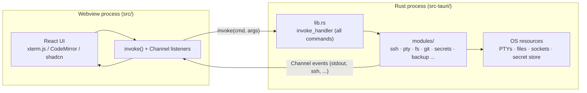

# Architecture

The authoritative technical reference for Tervia: how the system is structured
and why it is built that way. Read this to understand the design; use
[TERVIA.md](TERVIA.md) as the dense per-module map and navigation index, and
[CONTRIBUTING.md](CONTRIBUTING.md) for build, test, and PR conventions.

Tervia is a desktop client for remote machines. A saved connection opens an SSH
terminal, forwards a port, or browses the remote filesystem over SFTP, without
the user assembling a command line for it. Around that sits the local workspace
needed to actually work on those machines: native PTY terminals, a CodeMirror
editor, a file explorer, split panes, tab groups, and workspaces. It is a
[Tauri 2](https://tauri.app) desktop app for macOS, Linux, and Windows.

Tervia is a fork of [TEDI](https://github.com/IlhamriSKY/TEDI), which is itself
a fork of [Terax](https://github.com/crynta/terax-ai). Both upstreams are
Apache-2.0. The fork narrowed the scope hard: the AI agent, the extension
system, the in-app browser, and the Source Control panel were all removed on
purpose, not lost in a merge.

## 1. The big picture: a two-process app

Tervia has two halves that never share memory:

- **Frontend** (`src/`): a React 19 + TypeScript app rendered in a webview
  (xterm.js terminals with the WebGL renderer, CodeMirror 6 editor, shadcn/ui).
  It owns all UI and client state and never touches the OS directly.
- **Backend** (`src-tauri/`): a Rust process that owns every OS resource: PTYs,
  the filesystem, git, SSH, the platform secret store, and child processes.

The webview reaches the OS only by calling `invoke("command_name", args)`, which
runs a `#[tauri::command]` function in Rust. Long-lived output (terminal bytes,
SSH events, SFTP upload progress) streams back over a Tauri `Channel`. Every
command is registered in one place, the `invoke_handler` block in
[`src-tauri/src/lib.rs`](src-tauri/src/lib.rs), so that one file is the complete
index of the backend API surface (80 commands today).



There are three kinds of webview: the main window, a separate **Settings
window** (entry [`src/settings/main.tsx`](src/settings/main.tsx), opened by the
`open_settings_window` command), and **float windows** (entry
[`src/float/main.tsx`](src/float/main.tsx), opened by `open_float_window`,
labeled `float-<leafId>`) that pop one pane out as an always-on-top window
mirroring a live terminal, an editor, or the board. They share persisted state
through `tauri-plugin-store`, not through React, so any store the main window
reads must be hydrated in the others too. This is why two similarly named
folders exist:

| Folder                  | Role                                                                  |
| ----------------------- | --------------------------------------------------------------------- |
| `src/settings/`         | The Settings UI (a separate webview).                                 |
| `src/modules/settings/` | The settings state layer (store + preferences), read by both windows. |

## 2. Design principles

These invariants shape the whole codebase. Violating one is almost always a bug.

- **The webview never touches the OS.** All OS access is a `#[tauri::command]`.
  The single `invoke_handler` in `lib.rs` is the audit surface and the API index.
- **Modules are self-contained.** Each `src/modules/<area>/` feature imports only
  through the `@/*` alias, never a relative path across modules. A guard,
  `scripts/check-imports.mjs`, enforces this. Most expose a thin `index.ts` barrel.
- **Tabs never unmount.** Switching tabs hides the inactive one with
  `pointer-events-none invisible` (see `panes/PaneStack.tsx`), so PTYs and dev
  servers keep streaming in the background. State lives in `tabs/lib/useTabs`,
  the source of truth.
- **Credentials only ever live in the platform secret store.** SSH passwords,
  private keys, and key passphrases go through the Rust `secrets_*` commands
  under the service name `tervia-ssh`. They never touch the settings store,
  `localStorage`, or the connection store, which holds only metadata plus
  `hasPassword` / `hasPrivateKey` / `hasKeyPassphrase` flags. The one place a
  secret leaves the machine is the connection backup, which is sealed before it
  is written (Section 5).
- **A remote path is never resolved against the local disk.** Every "is this
  file local?" decision routes through `isRemoteEditorLeaf` /
  `editorPaneSession` in `terminal/lib/panes.ts`. An editor leaf that is remote
  but has no live session resolves to `"blocked"` and refuses to mount, because
  `useDocument` falls back to the local filesystem when no session is set —
  which is how a remote path once got read from, and on the next save written
  to, the wrong machine.
- **Canonical path form on the frontend is forward-slash.** OSC 7 already arrives
  forward-slash; `homeDir()` returns backslashes on Windows and is converted at
  the boundary. Anywhere a path may come from the OS or the explorer, split with
  `.split(/[\\/]/)` — or better, use the helpers in `src/lib/path.ts`.
- **No blocking work in a sync `#[tauri::command]`.** On Windows a sync command
  runs on the WebView2 UI thread, so blocking inside one freezes the window.
  That shipped three times, so the allowed set is now pinned by a test
  (`ui_thread_guard::no_new_sync_tauri_commands` in `lib.rs`); the default for
  anything touching the filesystem, a subprocess, a socket, or a pipe is
  `pub async fn` plus `spawn_blocking`.
- **App.tsx coordinates, it does not implement.** The top-level component owns
  the shared runtime handles (per-leaf terminal/editor/search maps, the live-tab
  cache) and composes the domain hooks under `src/app/hooks/`. Feature logic
  lives in `src/modules/<area>/`.

## 3. Backend (Rust, `src-tauri/src/`)

`lib.rs` registers every command and drives app boot plus CLI dispatch. `main.rs`
is a thin shim. Logic is split into `modules/` (folders for multi-file
subsystems, flat files for single-purpose ones).

| Module                                              | Responsibility                                                                                                                                                                                                                                                         |
| --------------------------------------------------- | ---------------------------------------------------------------------------------------------------------------------------------------------------------------------------------------------------------------------------------------------------------------------- |
| `ssh/`                                              | The product. Interactive SSH sessions and SFTP (`russh` + `russh-sftp`), host-key pinning, ProxyJump chaining, `ssh -L` forwards, remote git. Section 5.                                                                                                               |
| `pty/`                                              | Local interactive PTYs (xterm <-> `portable-pty`), shell integration scripts, Windows Job Objects.                                                                                                                                                                     |
| `pty_daemon/`                                       | Sidecar process that owns PTYs across GUI restarts (see Section 6). Same binary, `--pty-daemon`.                                                                                                                                                                       |
| `fs/`                                               | Explorer and editor IO, fuzzy finder, content search and replace (`ignore` + `grep-*` crates).                                                                                                                                                                         |
| `git/`                                              | Runs `git` and parses status/diff into structured payloads (explorer decorations, branch name). Its porcelain parsers are reused for remote repos.                                                                                                                     |
| `backup.rs`                                         | Passphrase-sealed blobs for the SSH connection backup: PBKDF2-HMAC-SHA256 + AES-256-GCM over `ring`.                                                                                                                                                                   |
| `secrets.rs`                                        | Platform secret store: macOS Keychain via `keyring`, Windows DPAPI file, Linux 0600 file. One JS-facing API, no platform branching in TS.                                                                                                                              |
| `format.rs`                                         | Direct-spawn external formatter executor (`fmt_run_external`).                                                                                                                                                                                                         |
| `clipboard.rs`                                      | Clipboard **reads** in the host process (`arboard`), because `navigator.clipboard.readText()` cannot work under wry's WebKitGTK defaults. Writes stay on the webview API.                                                                                              |
| `net.rs`                                            | HTTP probe and TCP port check, used by the "open in browser" pill's project-URL detection.                                                                                                                                                                             |
| `shell/`                                            | One-shot exec, a persistent session shell, and bounded-log background processes. Registered but currently unused by the frontend — see the note below.                                                                                                                 |
| `cli.rs`                                            | Startup argv capture for `tervia .` / `tervia <path>`, single-instance forwarding, macOS "Open With" URL delivery, and the `~/.local/bin/tervia` PATH shim installer. `--update` is captured here and handed to the in-app updater; there is no headless install path. |
| `appimage.rs`                                       | Strips the AppImage runtime's `LD_LIBRARY_PATH` from spawned children so a system `git` / `php` does not link against bundled libraries.                                                                                                                               |
| `cli_paint.rs`, `events.rs`, `ids.rs`, `lockext.rs` | CLI color output, event-name constants, the bundle-id/data-path source of truth, poison-safe lock helpers.                                                                                                                                                             |

The ten `shell_*` commands have no caller in `src/` today; they were the
execution surface for the removed AI agent. They are still registered and still
compile, so they are documented here as present rather than quietly implied to
be load-bearing.

### CLI surface and binaries

The GUI binary is `TerviaApp` (crate `tervia`, library `tervia_lib`). On Windows
a separate workspace member, `src-tauri/tervia-cli/`, builds a console-subsystem
stub named `tervia.exe`; the GUI binary is renamed so PATHEXT finds the stub
first, and the stub re-exports `cli::help_text()` and the version constant from
`tervia_lib` so the help text is single-sourced. `cli.rs` and `cli_paint.rs` are
the whole CLI: there are no subcommands, only `<path>`, `--help`, `--version`,
and `--update`.

## 4. Frontend (React, `src/`)

React app across three webview entry points (`index.html`, `settings.html`,
`float.html`), path alias `@/*` -> `src/*`. `app/App.tsx` is the ~800-line
coordinator described in Section 2. Feature code lives in 16 self-contained
modules.

| Module            | Responsibility                                                                                                                                                                          |
| ----------------- | --------------------------------------------------------------------------------------------------------------------------------------------------------------------------------------- |
| `ssh/`            | Saved-connection store, the connection dialog, host-key prompt queue, remote SFTP explorer, encrypted backup, headless tunnels. Section 5.                                              |
| `terminal/`       | xterm.js sessions, the local PTY bridge and the SSH session driver, OSC 7/133 shell-integration handlers, URL detection and auto-forwarding, AI-CLI detection, terminal themes.         |
| `editor/`         | CodeMirror 6 stack, language modes, format-on-save, vim mode, markdown preview, find/replace.                                                                                           |
| `explorer/`       | File tree, Material/Catppuccin icons, fuzzy search, workspace grep and replace, git decorations, keyboard nav, inline rename.                                                           |
| `panes/`          | Split-pane orchestration (horizontal/vertical) via `react-resizable-panels`, plus the float-window host and its protocol.                                                               |
| `tabs/`           | The tab model (source of truth): `useTabs`, workspace-cwd derivation, serialization.                                                                                                    |
| `workspaces/`     | Workspace persistence and switching (tab layout + cwd), the workspaces panel, and the agent board.                                                                                      |
| `header/`         | Top bar, tab strip, inline search, the SSH menu, custom window controls (Linux/Windows).                                                                                                |
| `statusbar/`      | Bottom bar, cwd breadcrumb, SSH route pill, zoom control, right-column toggles.                                                                                                         |
| `rightPanel/`     | Which sidebar sections are currently docked into the right column, and where each section is placed.                                                                                    |
| `shortcuts/`      | Keymap catalog, global shortcut dispatch, and the shared command registry the palette runs against.                                                                                     |
| `commandPalette/` | Ctrl+Shift+P palette over that registry, with `@` switching it to `fs_search` file search.                                                                                              |
| `settings/`       | Shared settings store and preferences (state layer read by every window).                                                                                                               |
| `theme/`          | `next-themes`-style provider plus the custom-theme runtime.                                                                                                                             |
| `scm/`            | Thin frontend for the Rust `git_*` commands: status, ignored list, branch, log. No panel — the explorer's decorations and the workspaces panel's branch display are the only consumers. |
| `updater/`        | In-app updater UI on top of `tauri-plugin-updater`.                                                                                                                                     |

### Tab model

A tab is now a single kind, defined in `tabs/lib/tabTypes.ts`:

```
Tab = PaneTab
```

`PaneTab` (`kind: "pane"`) holds a split-pane tree whose leaves are one of
`terminal`, `editor`, or `board` (`terminal/lib/panes.ts`). The alias `Tab` is
kept because the app talks about tabs everywhere and the layer used to carry
other kinds. Tabs are never unmounted on switch.

Remoteness is a property of a leaf, not of a tab kind:

- a `terminal` leaf with `sshConnectionId` connects to that saved host instead of
  spawning a local PTY;
- an `editor` leaf with `sshConnectionId` (stable, persisted) and/or
  `sshSessionId` (live, never persisted) reads and writes over SFTP.

## 5. Remote machines (`src-tauri/src/modules/ssh/`, `src/modules/ssh/`)

This is the largest and most load-bearing subsystem in the tree, and the reason
the app exists.

### Saved connections

`ssh/connections.ts` owns the connection list in a `LazyStore` at
`tervia-ssh-connections.json`. A row holds host, port, user, `authMode`
(`password` | `key` | `agent`), an optional `proxyJumpId`, an optional list of
`forwards`, the last-seen server fingerprint, and boolean flags for which
secrets exist. The secrets themselves are read and written through
`secrets_get` / `secrets_set` / `secrets_delete` under service `tervia-ssh` with
account `<connectionId>::<field>`.

Two details are load-bearing:

- **`authFields(authMode, secrets)`** is the single mapping from an auth mode to
  the credential half of an `openSsh` input. It used to be spelled out at four
  call sites, and a missed one connects with no credentials at all.
- **Every store mutation goes through one serialized write queue.** A chained
  connect fires `markConnected` once per jump hop plus once for the target,
  near-simultaneously; losing a freshly pinned fingerprint to an interleaved
  read-modify-write would silently drop that host back to a TOFU prompt.

### Session model

The backend mirrors the local PTY command shape on purpose — `ssh_open`,
`ssh_write`, `ssh_resize`, `ssh_close` — so a terminal pane can swap a local PTY
for a remote shell with minimal plumbing. `openSshForSession`
(`terminal/lib/ssh-session.ts`) returns an adapter that satisfies the same
`PtySession` interface the local path returns.

Every session runs on one shared 2-worker tokio runtime (`tervia-ssh`); russh is
async-first and per-session executors would duplicate thread pools. Sessions
live in `SshState` keyed by a `u32`, and each one spawns a janitor task that
evicts its slot when the pump task exits, so a remote hangup does not leak an
entry. Output streams back as `SshEvent` over a `Channel` (`connected`,
`jumpConnected`, `hostKeyPrompt`, `data`, `stderr`, `exit`, `error`), with
payload bytes base64-encoded.

Host-key and public-key signature algorithms are pinned to russh 0.60's vetted
default set **minus bare `ssh-rsa`** (RSA with SHA-1, which OpenSSH disabled by
default in 8.8). Pinning the list also freezes the posture across russh bumps.

### Host-key pinning and the TOFU prompt

Verification is SHA-256 fingerprint pinning, and the first connect is the
interesting case.

On a first connect the saved row has no `lastFingerprint`, so `ssh_open` is
called without `expected_fingerprint`. The backend's `check_server_key` parks a
one-shot sender in a process-global map, emits a `hostKeyPrompt` event carrying
an opaque prompt id, and **pauses the handshake before any credential is sent**.
The frontend queues it in `hostKeyPrompt.ts` (a queue, not a slot, so two
concurrent first-connects each get a turn), `HostKeyPromptDialog` renders
`queue[0]`, and the answer returns via `ssh_confirm_host_key(promptId, accept)`.
Silence is a rejection after a 120 s cap, so a forgotten dialog cannot hold the
TCP connection open.

Accepting pins immediately, via `pinFingerprint`, rather than waiting for a
successful connect. That is deliberate and matches OpenSSH, which writes
`known_hosts` the moment you answer yes: pinning only on success meant a wrong
password re-asked the host-key question on every retry, and a key trusted during
the dialog's Test button was forgotten by the time the connection was saved. The
prompt names only a _host_, and one chained connect can produce prompts for
several hops, so `hostKeyOwners` maps the host back to whichever saved rows own
it and pins all of them.

Every later connect passes `expected_fingerprint`. A mismatch aborts the
handshake with an error prefixed `ssh: host key mismatch:`; the frontend detects
that prefix, parks the leaf in `error` instead of auto-reconnecting, and the
user clears the saved fingerprint to re-trust a legitimately rotated key.
Duplicating a connection deliberately does _not_ copy the pinned key: a copy
exists to be pointed at a different machine, and carrying the fingerprint over
would fail the next connect as an apparent attack.

### Jump hosts

A connection's `proxyJumpId` names another saved connection to reach it through,
and chains transitively. The chain is resolved **on the frontend** by
`resolveJumpHops`, which walks it from the target outward, reads each hop's
secrets from the secret store, reverses into connect order (publicly reachable
entry host first), and hands the backend a plain ordered list to dial in
sequence. Cycle detection is seeded with the target's own id, a missing hop is
an error rather than a silently dropped tunnel, and the chain is capped at 16
hops.

Each hop that authenticates emits `jumpConnected` carrying the saved-connection
id it came from, so its fingerprint is pinned on the right row. The chain is
also surfaced to the user: `status.ts` builds an `SshRouteHop[]` with a
`pending` / `up` / `failed` state per hop, rides it on the status object every
emit site already sends, and the status bar's `SshRoutePill` renders it — so a
broken connect names the link that broke instead of just failing.

On a drop, the session driver retries three times with 1 s / 3 s / 7 s backoff.
Before each retry it writes a DECRST teardown to the local xterm, because the
remote program (vim, htop, tmux) never got to reset its modes and leftover mouse
tracking otherwise streams motion reports into the reconnected shell as garbage.

### Port forwarding

`ssh_forward_open(id, local_port, remote_host, remote_port)` binds
`127.0.0.1:local_port` and tunnels every connection to `remote_host:remote_port`
**as resolved from the server**, over the live session — so a ProxyJump chain
applies for free. `local_port` 0 lets the OS pick, and the bound port is
returned. There is deliberately no close command: forwards are declared on the
saved connection and re-opened on every connect, so the session's own teardown
is the only lifecycle they need.

Three callers, three shapes:

1. **Declared forwards.** After the shell channel comes up,
   `openSshForSession` fires each of `conn.forwards` as fire-and-forget: an
   already-taken local port is worth a line in the terminal, not a failed shell.
2. **Auto-forwarded dev servers.** When a remote shell prints a
   `localhost:PORT` URL, `forwardDetectedUrl` binds an OS-chosen local port,
   tunnels it to that port on the server's loopback, and rewrites the URL's
   authority so the pill opens something that actually resolves. The per-spawn
   cache holds the in-flight _promise_, not the resolved port, because a dev
   server prints its banner in bursts and caching only results would leave two
   tunnels standing for one port.
3. **Headless tunnels.** `ssh/tunnel.ts` opens a forward for a saved connection
   with no terminal attached — the "reach a database only the bastion can see"
   case. Sessions are refcounted per connection id so several forwards share one
   SSH session, and forwards are memoized by `connId|host|port` so a repeat
   request reuses its port. A connection with no pinned host key is **refused**:
   a first connect needs a human to verify the fingerprint, and nothing on this
   path can show that dialog. Note that this module currently has no in-tree
   caller; it is the API the planned surfaces will use.

### SFTP and remote files

`ssh::sftp` reuses the russh `Handle` held by the session to open a fresh `sftp`
subsystem channel on demand. The remote SSH user owns that channel, so every
operation is bounded by their unix permissions and a `permission denied` comes
back as a structured error the tree renders in place instead of crashing the
panel. The `DirEntry` shape deliberately matches the local `fs::DirEntry` so the
frontend tree reuses one renderer rather than branching on local vs remote.

A remote editor leaf resolves by _connection id_ at render time, not by holding
a session number, which is what lets it survive a restart and rebind itself when
a fresh session lands. "Reconnect" on such a pane just opens a normal SSH tab
for the saved profile, so host-key prompts and jump hosts run through the usual
terminal flow.

`ssh_git_status` and `ssh_git` run git over an exec channel on the same session,
reusing the local module's porcelain parsers and its subcommand allowlist. Two
hazards are handled explicitly: every argument is single-quoted before it
reaches the remote shell (`cwd` arrives from the remote's OSC 7, i.e. it is
attacker-controlled if the host is compromised), and only the last non-empty
output line is read, because sshd runs an exec request through the login shell
and a chatty `~/.bashrc` prepends its own greeting to every capture.

### Encrypted connection backup

Export writes a `.tervia-ssh` file: plaintext connection metadata plus one
sealed block holding every credential pulled back out of the secret store. The
credentials cannot travel any other way — a keychain does not move between
machines — and a plaintext export would be a credential leak the moment it
touched Downloads or a synced folder, so the block is always encrypted.

The crypto is `backup_seal` / `backup_open` in
[`src-tauri/src/modules/backup.rs`](src-tauri/src/modules/backup.rs), and it
lives in Rust for a specific reason: `crypto.subtle` is gated to secure
contexts and the app origin is plain http, so the webview simply cannot do it.
Construction is PBKDF2-HMAC-SHA256 (600,000 iterations, OWASP's 2023 floor for
an offline file with unlimited guesses) over a random 16-byte salt, then
AES-256-GCM with a random 12-byte nonce. Salt, nonce, and the iteration count
ride in the envelope, so raising the cost later still opens older backups.
GCM's auth tag is what makes a wrong passphrase, a truncated file, and a flipped
byte all fail closed with the _same_ message — distinguishing them would tell an
attacker which guess was closer.

Import decrypts before touching the store, so a wrong passphrase leaves the
existing connections exactly as they were. The merge is by connection id, which
is stable across renames, so re-importing updates instead of duplicating, and
nothing is ever deleted.

## 6. Data flow and lifecycles

### Command and event contract

Requests go webview -> Rust as `invoke(cmd, args)` returning a `Promise`.
Streaming output goes Rust -> webview over a Tauri `Channel<T>` (PTY bytes, SSH
events, SFTP upload progress). This is the only channel between the two
processes.

A handful of app-level notifications go the other way round, as ordinary Tauri
events rather than channels. Their names are declared once on each side —
`src-tauri/src/modules/events.rs` and `IPC_EVENTS` in `src/lib/ipc.ts` — because
a typo in a magic string just makes the listener never fire:
`tervia:settings-tab`, `tervia:open-cli-target`, `tervia:trigger-update`, plus
`tervia://float-destroyed` and `tervia://ssh-connections-changed` for
cross-window fan-out.

### Three end-to-end traces

**Typing `ls` in a local terminal.** xterm captures keystrokes ->
`terminal/lib/useTerminalSession` calls `invoke("pty_write", {id, data})` ->
the PTY daemon writes to the `portable-pty` master fd -> the shell runs `ls`,
a reader thread pushes stdout as `PtyEvent` over a `Channel` ->
`terminal/lib/osc-handlers.ts` parses OSC 7 (cwd) / OSC 133 (prompt markers) and
writes the raw bytes into the xterm buffer.

**Opening a file.** A click in `explorer/` calls `invoke("fs_read_file", {path})`
-> `fs/file.rs` reads it (large files stream a line range via
`fs_read_file_portion`) -> `tabs/` opens an editor leaf, `editor/EditorPane`
mounts a CodeMirror view, picks the language mode, and wires format-on-save.
For a remote leaf the same flow runs through `ssh_sftp_read_file` instead, on
the session resolved from the leaf's connection id.

**Connecting to a saved host.** The header's SSH menu opens a terminal leaf
carrying `sshConnectionId` -> `openSshForSession` loads the row, reads its
secrets, and resolves the ProxyJump chain (all at open time, so an edited chain
is picked up on the next reconnect) -> `invoke("ssh_open", ...)` dials each hop
in order -> the server presents its key; if the row has no pinned fingerprint
the handshake pauses and a `hostKeyPrompt` event raises the confirmation dialog
-> on acceptance the fingerprint is pinned, authentication proceeds, and
`connected` arrives with the session id -> declared `ssh -L` forwards are opened
on the fresh session -> remote bytes stream in over the same `Channel` and land
in xterm exactly like local PTY output.

### PTY daemon persistence

Local PTYs outlive a GUI window close so dev servers resume on next launch.
Surviving a PC restart or daemon crash is out of scope by design (both clear
sessions and the GUI falls back to a fresh spawn). SSH sessions are **not** part
of this: they live in the GUI process and a reconnect is a fresh remote shell,
not a reattach.

| Event                     | Daemon                                               | Sessions                          |
| ------------------------- | ---------------------------------------------------- | --------------------------------- |
| First GUI launch          | Spawned detached, 5 s connect budget                 | none                              |
| Window close              | Survives (detached process group / DETACHED_PROCESS) | Kept alive                        |
| GUI reopens               | Reconnects, `pty_attach(uuid)` per saved leaf        | Restored with replayed scrollback |
| PC restart / daemon crash | Process dies, no autostart                           | Lost (intended), GUI respawns     |
| Idle 24 h, no clients     | Self-shuts down (`TERVIA_PTYD_IDLE_SECS` overrides)  | Discarded                         |

If the daemon cannot spawn or connect, `pty/mod.rs` falls back to an in-process
backend and the frontend skips persistence (same behavior as pre-daemon
releases); `pty_attach` returns an error in that mode.

## 7. Key architectural decisions

| Decision                                            | Rationale                                                                                                                                                    |
| --------------------------------------------------- | ------------------------------------------------------------------------------------------------------------------------------------------------------------ |
| Two-process (Tauri) instead of Electron/Node        | Rust owns OS resources with no Node runtime in the trusted process; smaller, safer, faster.                                                                  |
| Single `invoke_handler` command index               | One audit surface and one place to discover the entire backend API.                                                                                          |
| `russh` in-process instead of shelling out to `ssh` | Structured events, a real host-key hook the UI can pause on, and per-hop feedback for a jump chain — none of which survive parsing another process's stderr. |
| Jump chains resolved on the frontend                | The saved-connection graph and its secrets already live there; the backend just dials an ordered list and stays free of store semantics.                     |
| Credentials in the platform secret store only       | They never touch disk in plaintext or web storage; a compromised renderer cannot read them at rest.                                                          |
| Backup crypto in Rust, not the webview              | `crypto.subtle` needs a secure context and the app origin is plain http, so the host process is the only place this can happen at all.                       |
| Forwards die with their session                     | Forwards are declarative state on a saved connection, so there is nothing to tear down separately and no way to leak a listener past a disconnect.           |
| PTY daemon sidecar                                  | Dev servers and long jobs survive a window close without surviving a crash or reboot (bounded).                                                              |
| Tabs never unmount                                  | Background PTYs, SSH sessions, and dev servers keep streaming; switching is instant.                                                                         |
| Pinned list of sync Tauri commands                  | A sync command blocks the WebView2 UI thread on Windows; a test makes adding one a deliberate act with a written reason.                                     |

## 8. Conventions

- **Imports:** always `@/...`, never a relative path across modules.
- **Icons:** [lucide-react](https://lucide.dev), imported by name. Brand marks
  without a Lucide equivalent live in `src/components/BrandIcon.tsx`; AI CLI
  marks live in `src/components/CliAgentIcon.tsx`; file-type icons resolve
  through `src/modules/explorer/lib/iconResolver.ts`.
- **Styling:** Tailwind v4 (config in `src/styles/` via `@theme`, no
  `tailwind.config.*`). Use `cn()` from `@/lib/utils`. shadcn/ui components are
  generated; regenerate rather than hand-editing.
- **Cross-platform:** resolve HOME and cache dirs via the `dirs` crate, never raw
  `$HOME`/`%USERPROFILE%`. Send `\r` (CR) for Enter, not `\n`. Gate Unix-only
  shell logic behind `#[cfg(unix)]` and keep Windows code in the `windows` arm.
- **Identity:** the bundle id `dev.rendy.tervia` (`dev.rendy.tervia.dev` in debug
  builds) is declared in `tauri.conf.json` and mirrored in
  `src-tauri/src/modules/ids.rs` for the callers that run before Tauri has an
  `AppHandle` (the CLI surfaces, the PTY daemon). Change one and you change both.
- **Adding a Tauri plugin:** three steps: a `Cargo.toml` dependency, a
  `.plugin(...)` call in `lib.rs`, and a capability entry in
  `src-tauri/capabilities/default.json`.

## 9. Not built yet

Two headline features are planned and **not implemented**. Nothing in the tree
backs them today, and no design detail is settled:

- **RDP.** Remote desktop sessions, listed alongside SSH in the same connection
  list.
- **Sync.** End-to-end encrypted sync of saved machines and keys across devices,
  such that the server only ever sees ciphertext.

Treat any code that looks like a hook for either of these as absent until it
appears here.

## 10. Where to go next

- **Dense per-module map and navigation:** [TERVIA.md](TERVIA.md), including
  every Tauri command, platform gotcha, the PTY daemon, the CLI entry points,
  and the formatter pipeline.
- **Contributing:** [CONTRIBUTING.md](CONTRIBUTING.md).
- **Security policy and reporting:** [SECURITY.md](SECURITY.md).
</content>

</invoke>
